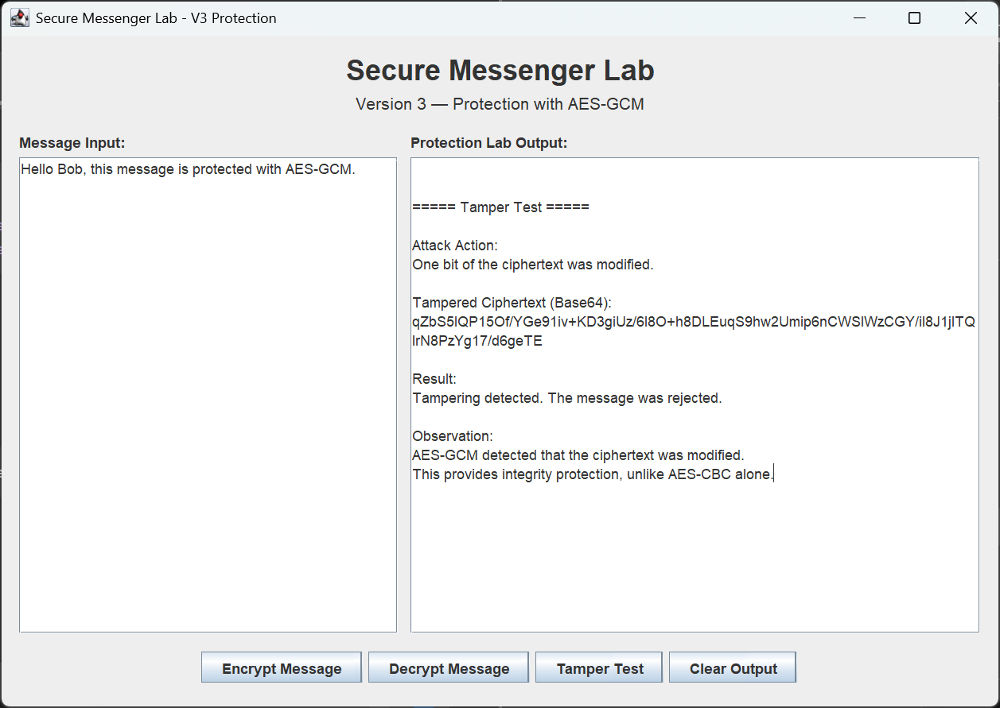

# 🔐 Secure Messenger Lab

A hands-on cybersecurity project that demonstrates how encrypted communication works, how it can be attacked, and how it can be secured properly.

---

## 🧠 Overview

This project started as a university assignment focused on AES encryption, then evolved into a practical security lab.

The core idea behind this project is:

> Encryption alone does not guarantee security.

Through this project, I demonstrate:

* How messages are encrypted using AES
* How attackers can manipulate encrypted data
* Why integrity and replay protection are critical
* How modern encryption (AES-GCM) solves these problems

---

## 🚀 Project Evolution

### 🟢 Version 1 — University CLI Version

* AES-CBC encryption and decryption
* Random key and IV generation
* Command-line interface
* Basic cryptography implementation

---

### 🔵 Version 2 — GUI Encryption Demo


* Java Swing interface
* User message input
* Encrypt / Decrypt buttons
* Visual representation of cryptographic output

---

### 🔴 Version 2.5 — Attack Simulation

#### Tampering Attack


#### Replay Attack


* Tampering attack simulation
* Replay attack simulation
* Demonstrates weaknesses of AES-CBC
* Shows how attackers can manipulate encrypted data

---

### 🟣 Version 3 — Protection with AES-GCM

#### Encryption + Decryption



#### Tamper Detection


* AES-GCM (Authenticated Encryption)
* Detects any modification in ciphertext
* Rejects tampered messages
* Provides both confidentiality and integrity

> Unlike AES-CBC, AES-GCM detects any modification in the ciphertext and rejects it, providing both confidentiality and integrity.

---

## ⚙️ Technologies Used

* Java
* Java Swing (GUI)
* AES Encryption
* AES-CBC Mode
* AES-GCM Mode
* SecureRandom
* Base64 Encoding

---

## 📂 Project Structure

```
Secure-Messenger-Lab/
├── src/
│   ├── SecureMessagingV1.java
│   ├── SecureMessengerGUI.java
│   ├── SecureMessengerV2_5.java
│   └── SecureMessengerV3.java
├── screenshots/
│   ├── v2-aes-encryption-gui.png
│   ├── v2-5-tampering-attack.png
│   ├── v2-5-replay-attack.png
│   ├── V3_Decypt_Encrypt.png
│   └── V3_Tamper_Test.png
├── README.md
└── docs/
```

---

## 📌 Key Takeaways

* AES-CBC provides confidentiality but not integrity
* Encrypted messages can still be modified without detection
* Replay attacks are possible without validation
* Secure systems must include:

  * Integrity protection
  * Authentication
  * Freshness (anti-replay)

---

## 🛠 Status

✅ Completed — Full encryption, attack simulation, and protection implementation

---

## 👨‍💻 Author

Saad Almutairi
