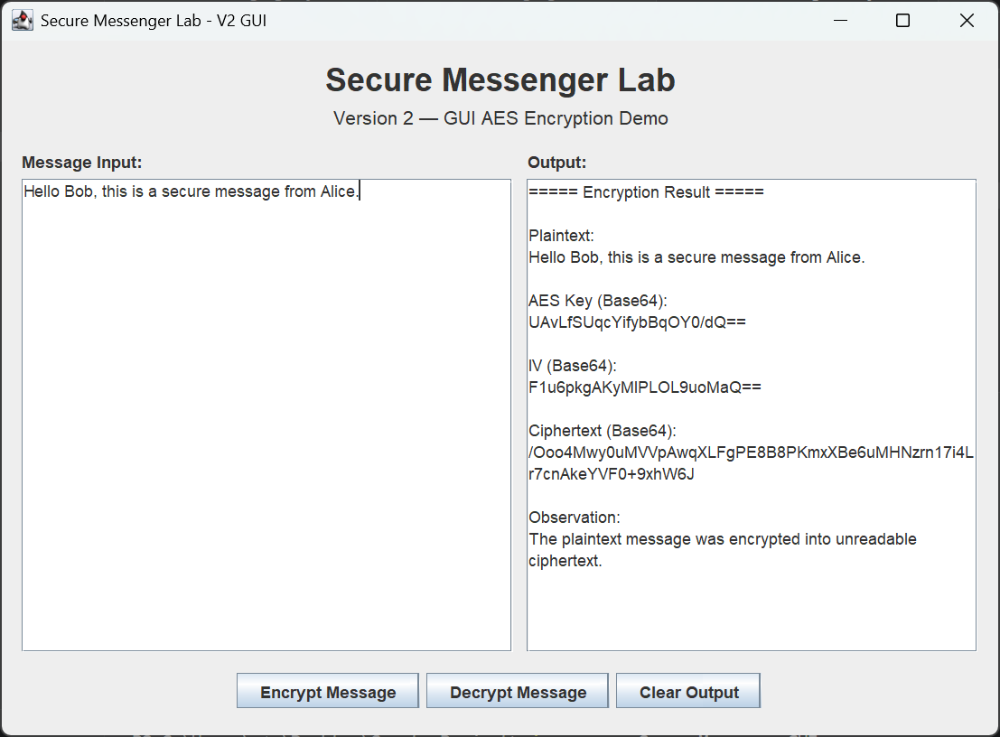
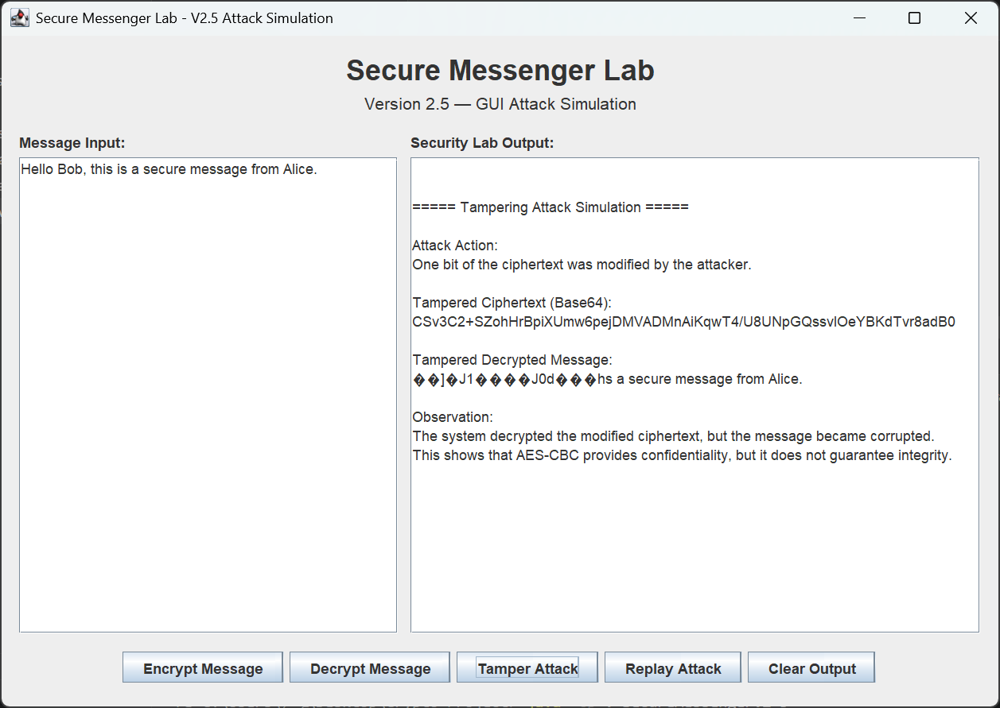
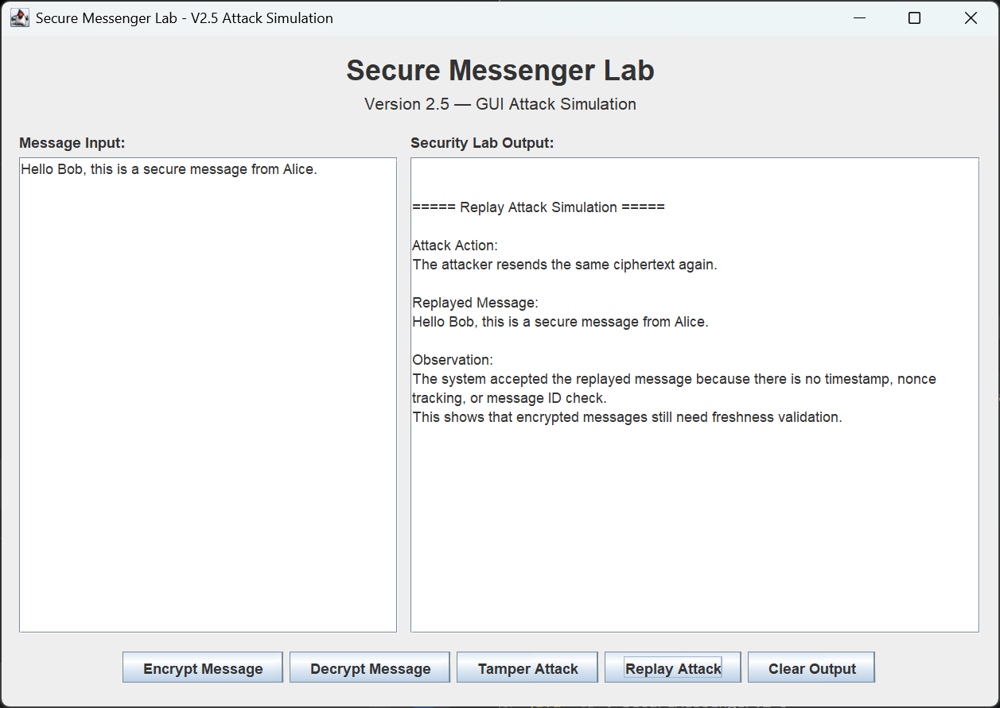
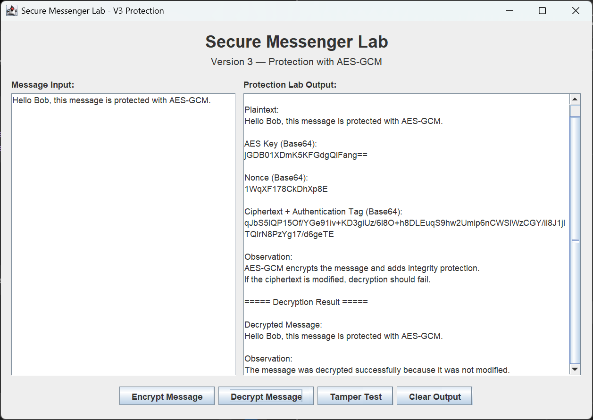
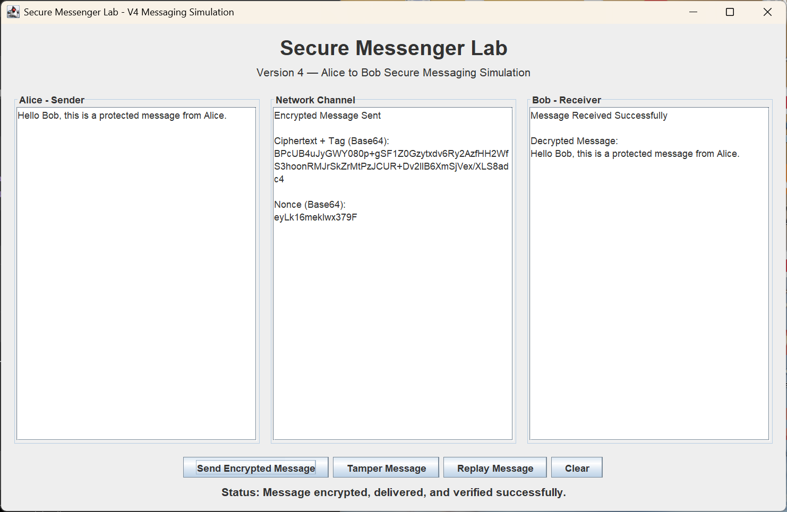
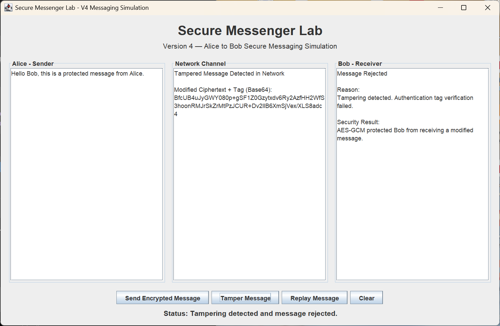
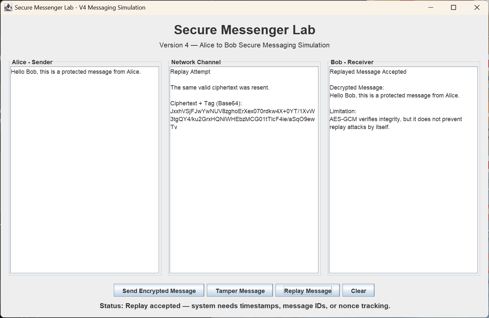

# Secure Messenger Lab 🔐

A cybersecurity-focused Java project that demonstrates the evolution of a secure messaging system through multiple versions, starting from basic AES encryption and progressing toward attack simulation and message protection using AES-GCM.

This project was originally developed as part of a university cryptography course, then expanded into a security analysis and secure messaging simulation project.

---

# Project Evolution

## Version 1 — Basic AES Encryption (CLI)

The first version demonstrates basic AES encryption and decryption using a command-line interface.

### Features
- AES encryption
- AES decryption
- Base64 output
- Simple CLI implementation

---

## Version 2 — GUI AES Encryption

The project was upgraded into a graphical user interface (GUI) application to improve usability and visualization.

### Features
- GUI-based encryption and decryption
- User message input
- AES encryption visualization

### Screenshot

---

## Version 2.5 — Attack Simulation

This version introduced security attack simulations to analyze weaknesses in encrypted messaging systems.

### Simulated Attacks
- Tampering Attack
- Replay Attack

### Goal
Demonstrate that encryption alone does not always guarantee complete message protection.

### Screenshots

#### Tampering Attack

#### Replay Attack

---

## Version 3 — AES-GCM Protection

The system was upgraded from AES-CBC to AES-GCM to add integrity protection and authentication.

### Improvements
- Tampering detection
- Authentication tag verification
- Secure message validation

### Security Result
Tampered messages are rejected instead of being decrypted.

### Screenshots

#### Encryption & Decryption

#### Tamper Detection

---

## Version 4 — Secure Messaging Simulation

The final version transforms the project into an interactive Alice-to-Bob secure messaging simulation.

### Features
- Alice and Bob messaging simulation
- Network channel visualization
- Encrypted message delivery
- Tampering detection
- Replay attack demonstration
- AES-GCM integrity protection

### Screenshots

#### Send Encrypted Message

#### Tamper Message

#### Replay Message

---

# Security Concepts Demonstrated

- AES Encryption
- AES-GCM
- Message Confidentiality
- Integrity Protection
- Authentication
- Tampering Attacks
- Replay Attacks
- Secure Messaging Concepts

---

# Technologies Used

- Java
- Java Swing (GUI)
- AES Encryption
- AES-GCM
- Base64 Encoding

---

# Educational Purpose

This project was developed for educational and cybersecurity learning purposes to explore how secure messaging systems evolve from simple encryption into more security-aware implementations.

---

# Author

Saad Almutairi

Cybersecurity Diploma Student  
Imam Mohammad Ibn Saud Islamic University
